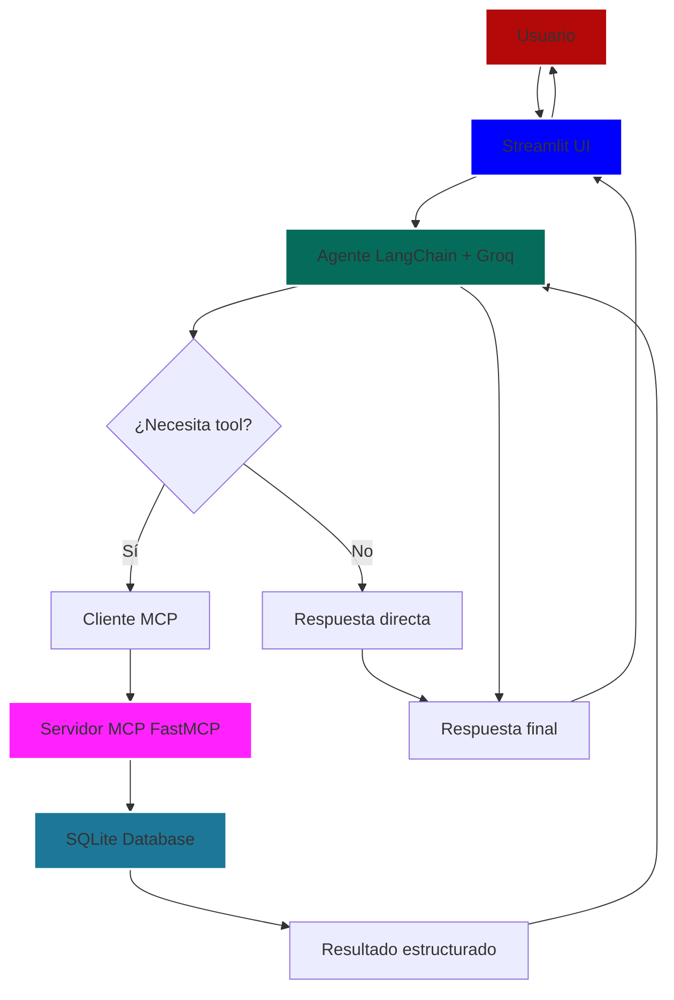

# 🛒 Asistente Comercial MCP

Sistema de agente de IA para análisis comercial de un e-commerce de productos alimenticios.

## 📋 Problema que resuelve

El asistente ayuda a equipos comerciales y de atención al cliente a obtener información rápida y verificable sobre:

- **Clientes**: Búsqueda, perfil de consumo, identificación de alto valor
- **Productos**: Productos más vendidos, análisis por categoría
- **Ventas**: Análisis por región, métodos de pago
- **Análisis**: Clasificación de clientes (VIP, Premium, Regular)
**Usuario principal:** Equipo comercial y de atención al cliente de un e-commerce.

**Necesidad:** Obtener información rápida y verificable sobre clientes, ventas, productos y regiones sin necesidad de consultar directamente bases de datos.

**Lo que cubre:**
- ✅ Búsqueda de clientes por nombre, apellido o región
- ✅ Perfil de consumo de clientes
- ✅ Productos más vendidos
- ✅ Análisis de ventas por categoría y región
- ✅ Preferencias de métodos de pago
- ✅ Clasificación de clientes (VIP, Premium, Regular)

**Lo que NO cubre:**
- ❌ Modificación de datos (solo lectura)
- ❌ Procesamiento de pagos
- ❌ Gestión de inventario en tiempo real


## 🏗️ Arquitectura del Sistema
### Arquitectura de Componentes
```text
┌───────────────────────────────────────────────────────────────┐
│                   USUARIO                                     │
└───────────────────────┬───────────────────────────────────────┘
                        │
                        ▼
┌───────────────────────────────────────────────────────────────┐
│               INTERFAZ WEB (Streamlit)                        │
│       app_streamlit.py                                        │
│       • Chat interactivo                                      │
│       • Visualización de evidencia                            │
│       • Gestión de session_id                                 │
└───────────────────────┬───────────────────────────────────────┘
                        │
                        ▼
┌───────────────────────────────────────────────────────────────┐
│               AGENTE LANGCHAIN + GROQ                         │
│       agent_core.py                                           │
│       • Interpretación de intención                           │
│       • Selección de herramientas                             │
│       • Memoria de corto plazo (InMemorySaver)                │
└───────────────────────┬───────────────────────────────────────┘
                        │
                        ▼
┌───────────────────────────────────────────────────────────────┐
│           CLIENTE MCP (langchain-mcp-adapters)                │
│           • Descubrimiento de herramientas                    │
│           • Invocación de tools                               │
└───────────────────────┬───────────────────────────────────────┘
                        │
                        ▼
┌───────────────────────────────────────────────────────────────┐
│               SERVIDOR MCP (FastMCP)                          │
│           mcp_server.py                                       │
│           • Exposición de 8 herramientas personalizadas       │
│           • Validación de entradas                            │
│           • Respuestas estructuradas                          │
└───────────────────────┬───────────────────────────────────────┘
                        │
                        ▼
┌───────────────────────────────────────────────────────────────┐
│                   BASE DE DATOS (SQLite)                      │
│           data/mcp_laboratorio.db                             │
│           • clientes • ventas • productos                     │
│           • categorias • metodos_pago                         │
└───────────────────────────────────────────────────────────────┘
```

### Arquitectura


### Flujo de Ejecución

1.  **Usuario** escribe una pregunta en Streamlit
    
2.  **Streamlit** envía la pregunta al agente con session\_id
    
3.  **Agente LangChain + Groq** interpreta la intención
    
4.  **Decisión**:
    
    -   Si necesita datos → Invoca tool MCP
        
    -   Si no → Responde directamente
        
5.  **MCP Server** ejecuta la tool contra SQLite
    
6.  **Resultado** vuelve al agente
    
7.  **Agente** sintetiza respuesta con evidencia
    
8.  **Streamlit** muestra respuesta, tools usadas y traza
    
9.  **Memoria** guarda contexto para siguiente interacción

### Componentes y Responsabilidades

| Capa | Tecnología | Archivo | Responsabilidad |
|------|-----------|---------|-----------------|
| **Interfaz** | Streamlit | app_streamlit.py | Recibir preguntas, mostrar respuesta y evidencia |
| **Orquestación** | LangChain + Groq | agent_core.py | Interpretar intención, elegir tools, gestionar memoria |
| **MCP** | FastMCP | mcp_server.py | Exponer tools personalizadas con contratos claros |
| **Datos** | SQLite | data/ | Entregar información y ejecutar operaciones controladas |
| **Memoria** | InMemorySaver | agent_core.py | Mantener contexto de la conversación por session_id |


## 🛠️ Tecnologías Utilizadas

| Tecnología | Versión | Propósito |
|------------|---------|-----------|
| **Python** | 3.10+ | Lenguaje base |
| **Streamlit** | 1.28+ | Interfaz web |
| **LangChain** | 0.3+ | Orquestación del agente |
| **Groq** | - | Modelo de lenguaje (llama-3.3-70b-versatile) |
| **FastMCP** | 0.3+ | Servidor MCP |
| **SQLite** | 3.x | Base de datos local |
| **Pandas** | 2.0+ | Procesamiento de datos |


## 🔧 Herramientas MCP

| Tool | Propósito | Entrada | Salida | Riesgo |
|------|-----------|---------|--------|--------|
| `buscar_clientes` | Buscar clientes | texto_busqueda, limite | Lista de clientes | Bajo |
| `perfil_consumo_cliente` | Perfil de consumo | cliente_id | Métricas de consumo | Bajo |
| `clientes_alto_valor` | Clientes con alto gasto | gasto_minimo, limite | Top clientes | Bajo |
| `top_productos_vendidos` | Productos más vendidos | limite, ordenar_por | Ranking de productos | Bajo |
| `analisis_categoria` | Ventas por categoría | categoria (opcional) | Métricas por categoría | Bajo |
| `ventas_por_region` | Ventas por región | region (opcional) | Métricas por región | Bajo |
| `preferencia_metodo_pago` | Preferencias de pago | region (opcional) | Métricas de pago | Bajo |
| `calcular_nivel_cliente` | Clasificar cliente | gasto_total, total_ordenes | Nivel y recomendación | Bajo |

## 🧠 Memoria

- **Tipo:** Corto plazo (InMemorySaver)
- **Session ID:** Identificador único por conversación
- **Ventana:** Últimos 6-10 mensajes
- **Limitación:** La memoria se pierde al reiniciar el servidor

## 🔐 Secretos y Configuración

### Variables de Entorno Requeridas

| Variable | Descripción | Dónde obtenerla |
|----------|-------------|-----------------|
| `GROQ_API_KEY` | API Key de Groq | [console.groq.com](https://console.groq.com) |
| `GROQ_MODEL` | Modelo a usar | `llama-3.3-70b-versatile` |
| `MCP_SERVER_URL` | URL del MCP Server | Local: `http://127.0.0.1:8000/mcp` |

### Configuración Local (.env)

1. Copia el archivo de ejemplo:
```bash
cp .env.example .env
```

2. Edita `.env` con  tus valores:
```env
GROQ_API_KEY=gsk_tu_api_key_aqui
GROQ_MODEL=llama-3.3-70b-versatile
MCP_SERVER_URL=http://127.0.0.1:8000/mcp
```

### Configuración para Streamlit Cloud (Secrets)

En la interfaz de Streamlit Cloud, agrega estos secretos:
```toml
GROQ_API_KEY = "gsk_tu_api_key_aqui"
GROQ_MODEL = "llama-3.3-70b-versatile"
MCP_SERVER_URL = "https://tu-mcp-server.onrender.com/mcp"
```

## 🚀 Instalación Local

1. **Clonar el repositorio**
```bash
python -m venv .venv
source .venv/bin/activate  # Linux/Mac
# .venv\Scripts\activate   # Windows
```

2. **Clonar el repositorio**
```bash
git clone https://github.com/systemyuri/agente-mcp-groq.git
cd agente-mcp-groq
```

3. **Instalar dependencias**
```bash
pip install -r requirements.txt
```

4. **Configurar variables de entorno**
```bash
cp .env.example .env
# Edita .env con tu GROQ_API_KEY
```

5. **Preparar datos**
```bash
# Coloca tus archivos CSV en la carpeta data/
python load_data.py
```

6. **Ejecutar el MCP Server (Terminal 1)**
```bash
python mcp_server.py
```
**Salida esperada:**
```text
🚀 Iniciando MCP Server...
   Base de datos: data/mcp_laboratorio.db
   ✅ Con validación de tipos para parámetros

📋 Tools disponibles:
   - buscar_clientes
   - perfil_consumo_cliente
   - clientes_alto_valor
   - top_productos_vendidos
   - analisis_categoria
   - ventas_por_region
   - preferencia_metodo_pago
   - calcular_nivel_cliente

🌐 Servidor HTTP escuchando en http://127.0.0.1:8000
   Endpoint MCP: http://127.0.0.1:8000/mcp
```

7. **Ejecutar Streamlit (Terminal 2)*
```bash
streamlit run app_streamlit.py
```


## 🌐 Despliegue

### En Streamlit Community Cloud

1.  **Sube el código a GitHub**
    

```bash

git add .
git commit -m "feat: Asistente Comercial MCP con Groq"
git push origin main
```
2.  **Ve a** [share.streamlit.io](https://share.streamlit.io)
    
3.  **Conecta tu repositorio**
    
    -   Selecciona GitHub
        
    -   Elige el repositorio y rama `main`
        
    -   Archivo principal: `app_streamlit.py`
        
4.  **Configura los Secretos**  
    En la sección "Secrets", agrega:
    
    ```toml
    
    GROQ_API_KEY = "gsk_tu_api_key_aqui"
    GROQ_MODEL = "llama-3.3-70b-versatile"
    MCP_SERVER_URL = "https://tu-mcp-server.onrender.com/mcp"
    ```

5.  **Despliega**
    
    -   Haz clic en "Deploy"
        
    -   Espera ~5 minutos
        
    -   ¡Obtendrás tu URL pública!
        

### MCP Server Remoto

**Opción 1: [Render.com](https://Render.com) (Recomendado)**

Crea `render.yaml`:

```yaml

services:
  - type: web
    name: mcp-server
    env: python
    buildCommand: pip install -r requirements.txt
    startCommand: python mcp_server.py
    envVars:
      - key: GROQ_API_KEY
        sync: false
```

**Opción 2: ngrok (Para pruebas rápidas)**

```bash

# Terminal 1
python mcp_server.py
# Terminal 2 (nueva terminal)
ngrok http 8000
# Copia la URL https://xxxx.ngrok.io
# Actualiza MCP_SERVER_URL con esta URL + /mcp
```

* * *

## 📁 Estructura del Proyecto

```text

mi_agente_mcp_groq/
├── app_streamlit.py          # Interfaz web
├── agent_core.py             # Lógica del agente (Groq, MCP, memoria)
├── mcp_server.py             # Servidor MCP con herramientas
├── load_data.py              # Script para cargar datos
├── requirements.txt          # Dependencias
├── README.md                 # Este archivo
├── .gitignore               # Archivos a ignorar
├── .env.example             # Ejemplo de variables de entorno
├── data/                    # Datos
│   ├── clientes.csv
│   ├── ventas.csv
│   ├── productos.csv
│   ├── categorias.csv
│   └── metodos_pago.csv
├── tests/                   # Pruebas
│   ├── test_tools.py
│   └── test_agent.py
└── .streamlit/
    └── secrets.toml.example # Ejemplo de secretos
```

* * *

## 🔗 Enlaces

### Producción y Repositorio

-   **App en Producción:** [https://tu-app.streamlit.app](https://tu-app.streamlit.app)
    
-   **Repositorio GitHub:** [https://github.com/systemyuri/agente-mcp-groq](https://github.com/systemyuri/agente-mcp-groq)
    

### Documentación Oficial

-   **Model Context Protocol:** [https://modelcontextprotocol.io](https://modelcontextprotocol.io)
    
-   **LangChain Documentation:** [https://docs.langchain.com](https://docs.langchain.com)
    
-   **Streamlit Docs:** [https://docs.streamlit.io](https://docs.streamlit.io)
    
-   **Groq Console:** [https://console.groq.com](https://console.groq.com)
    
-   **FastMCP:** [https://github.com/jlowin/fastmcp](https://github.com/jlowin/fastmcp)
    

* * *

## 👥 Equipo

-   **Desarrollador:** David Yurivilca
    
-   **Curso:** Estrategias de Integracion
    
-   **Fecha de Entrega:** 19/07/2026
    

* * *

## 📄 Licencia

MIT - Libre para uso educativo.

* * *

## 🙏 Agradecimientos

-   **Groq** por el modelo de lenguaje de alto rendimiento
    
-   **LangChain** por la orquestación del agente
    
-   **FastMCP** por el servidor de herramientas
    
-   **Streamlit** por la interfaz web
    
-   **Guía del Curso** por la estructura y requisitos